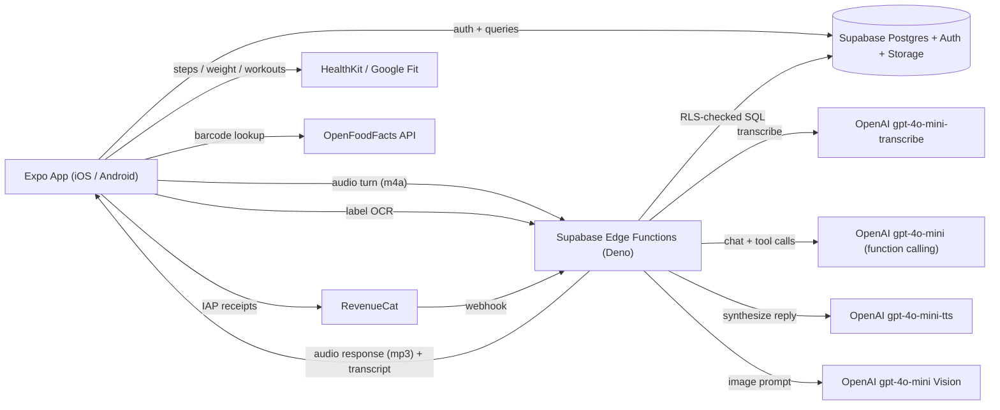

# AI Kitchen

A friendly, cross-platform calorie- and nutrition-tracking app with a turn-by-turn voice cooking assistant that rebalances recipes to fit your day.

> **Working on a fresh machine?** Read [docs/SETUP.md](docs/SETUP.md) first. **Want context on what's done and what's next?** [docs/STATUS.md](docs/STATUS.md). **Want the full design plan?** [docs/PLAN.md](docs/PLAN.md).

---

## What it does

AI Kitchen is a calorie/macro tracker for people who want to eat better but don't speak gym. Three things make it different from MyFitnessPal et al.:

1. **Voice cooking** — pick a recipe, tap "Cook with me", and an AI coach talks you through it step by step while watching your remaining calories, protein, fiber, and sodium for the day. If you're short on budget it will quietly shrink a portion or suggest a swap.
2. **Plain-language AI nudges** instead of dense graphs. "Light on fiber so far — beans or whole grains tonight would help." Surfaced 1–3 times a day on the Today screen.
3. **AI-assisted logging** — barcode scan + nutrition label OCR mean you almost never type nutrition info by hand.

For full background, see the design plan in `.cursor/plans/` (or ask your AI assistant).

---

## Tech stack

| Layer | Choice | Why |
| --- | --- | --- |
| Mobile | Expo (React Native) + TypeScript, Expo Router, NativeWind | Fast cross-platform MVP, file-based routing, Tailwind ergonomics |
| State | Zustand + TanStack Query | Tiny client state + server cache |
| Backend | Supabase (Postgres + Auth + Storage + Edge Functions) | SQL fits a nutrition tracker, predictable pricing, generous free tier |
| AI (voice cooking) | OpenAI `gpt-4o-mini-transcribe` + `gpt-4o-mini` (function calling) + `gpt-4o-mini-tts` | Turn-by-turn STT → LLM → TTS, ~$0.05/session |
| AI (label OCR) | OpenAI `gpt-4o-mini` Vision | Fractions of a cent per scan |
| AI (nudges) | Deterministic rules + `gpt-4o-mini` for wording | Negligible cost, daily cron |
| Subscriptions | RevenueCat | Handles IAP, receipts, webhooks |
| Observability | Sentry (errors) + PostHog (analytics) | Industry standard |
| CI/CD | EAS Build / Submit / Update | OTA updates for prompt iteration |

---

## Architecture



Voice turns are orchestrated server-side: the app records a short utterance with `expo-av`, uploads it to the `voice-turn` Edge Function, which does STT → LLM (with tool execution) → TTS in a single round trip and streams audio back. All AI tool execution (read budget, adjust ingredient, log meal) runs server-side using the user's authenticated Supabase context.

---

## Project structure

```
.
├── app/                      # Expo Router screens (file-based routing)
│   ├── _layout.tsx           # Root layout: providers, query client, Sentry init
│   ├── index.tsx             # Entry redirect
│   ├── (onboarding)/         # First-run wizard
│   ├── (tabs)/               # Main tab navigation
│   │   ├── _layout.tsx
│   │   ├── index.tsx         # Today screen
│   │   ├── recipes.tsx
│   │   └── profile.tsx
│   └── cook/[recipeId].tsx   # Voice cooking session
├── components/
│   └── ui/                   # Reusable primitives (Button, Card, ...)
├── lib/
│   ├── env.ts                # Zod-validated env vars
│   ├── supabase.ts           # Configured Supabase client
│   └── observability.ts      # Sentry + PostHog init
├── supabase/
│   ├── config.toml           # Local Supabase config
│   ├── migrations/
│   │   └── 0001_init.sql     # Initial schema + RLS + v_daily_intake view
│   └── seed.sql              # Local dev seed data
├── assets/                   # Icons, splash, fonts (add yours)
├── app.json                  # Expo config (permissions, plugins)
├── babel.config.js
├── eas.json                  # EAS Build profiles
├── global.css                # Tailwind entry
├── metro.config.js
├── nativewind-env.d.ts
├── tailwind.config.js
├── tsconfig.json
└── package.json
```

---

## Prerequisites

- **Node.js** 20+ and **npm** 10+
- **Expo CLI** comes via `npx`; no global install needed
- **Supabase CLI** — `brew install supabase/tap/supabase` (macOS) or [other platforms](https://supabase.com/docs/guides/local-development#installing-the-supabase-cli)
- **Docker Desktop** running, for local Supabase
- **iOS:** Xcode 15+ (for iOS Simulator) — macOS only
- **Android:** Android Studio with an emulator, or a physical device with [Expo Go](https://expo.dev/client) for early dev

> ⚠️ For features that need a development build (camera, audio recording), you'll need [EAS Build](https://docs.expo.dev/build/setup/) configured. The MVP scaffold runs fine in Expo Go.

---

## Setup

### 1. Install dependencies

```bash
npm install
```

### 2. Configure environment variables

Copy the example and fill in your keys:

```bash
cp .env.example .env
```

At minimum for local dev you'll need:

- `EXPO_PUBLIC_SUPABASE_URL` and `EXPO_PUBLIC_SUPABASE_ANON_KEY` — from `supabase start` output (see below), or your Supabase project dashboard.

The other keys (Sentry, PostHog, RevenueCat) are optional during early dev; the app will run without them.

### 3. Start Supabase locally

```bash
npm run db:start
```

This boots a local Postgres + Auth + Storage stack via Docker, applies the migrations in `supabase/migrations/`, and runs `supabase/seed.sql`.

The command prints the local URL and anon key — paste them into `.env`.

To regenerate TypeScript types from the schema:

```bash
npm run db:types
```

Helpful commands:

- `npm run db:reset` — wipe the local DB and re-apply migrations + seed
- `npm run db:diff` — diff your local schema vs the migrations folder
- `npm run db:push` — push migrations to a remote Supabase project
- `npm run db:stop` — stop the local stack

### 4. Server-side env vars (Edge Functions)

Edge Functions read from `supabase/.env.local`. Copy the example:

```bash
cp supabase/.env.example supabase/.env.local
```

Fill in `OPENAI_API_KEY` etc. These are never bundled into the mobile app.

### 5. Run the app

```bash
npm start
```

Press `i` for the iOS Simulator, `a` for Android, or scan the QR code with Expo Go on your phone.

---

## Database schema overview

The full schema lives in [`supabase/migrations/0001_init.sql`](supabase/migrations/0001_init.sql). High-level:

| Table | Purpose |
| --- | --- |
| `profiles` | One row per user. Goals, activity level, subscription tier, monthly usage counters. Auto-created on signup. |
| `foods` | Master food catalog. System foods (`owner_id IS NULL`) seeded from USDA + OFF; users can also create their own. |
| `food_logs` | Eating events. One row per logged food. |
| `recipes` | Seeded + user-imported recipes. Published flag for visibility. |
| `recipe_ingredients` | Recipe ↔ food join with grams + substitution hints. |
| `cooking_sessions` | One per "Cook with me" interaction. Holds the AI's per-session adjusted ingredient state. |
| `ai_messages` | Per-turn conversation history (text + audio URLs). |
| `weight_logs`, `activity_logs` | Weight + workout history (manual or HealthKit/Google Fit sync). |
| `nudges` | AI-generated daily nudges surfaced on Today screen. |

A `v_daily_intake` view aggregates `food_logs` × `foods` into per-(user, day) totals so the Today screen is one indexed query.

Every user-scoped table has **Row-Level Security** enabled with `auth.uid() = user_id` policies. System foods and published recipes are world-readable; everything else is owner-only.

---

## Scripts

| Command | What it does |
| --- | --- |
| `npm start` | Launch Metro / Expo dev server |
| `npm run ios` | Open iOS Simulator |
| `npm run android` | Open Android emulator |
| `npm run lint` | Run Expo's ESLint config |
| `npm run typecheck` | TypeScript with no emit |
| `npm run format` | Prettier write |
| `npm run db:start` | Start local Supabase stack |
| `npm run db:reset` | Reset local DB + reseed |
| `npm run db:types` | Regenerate `lib/database.types.ts` from local schema |
| `npm run functions:serve` | Serve Edge Functions locally |

---

## Roadmap

This MVP is sliced into ten todos. Tick them off in `.cursor/plans/`:

- [x] Scaffold Expo + EAS + NativeWind + observability
- [x] Supabase schema + RLS + daily intake view
- [ ] Auth (email + Apple + Google) and onboarding wizard with Mifflin-St Jeor calc
- [ ] Food search, USDA/OFF seeding, barcode lookup, manual log + quick-log
- [ ] Today screen: kcal counter, macro bars, meals list, HealthKit/Google Fit read
- [ ] Nutrition label OCR (`gpt-4o-mini` Vision Edge Function + camera UI)
- [ ] AI nudges engine (deterministic rules + `gpt-4o-mini` wording + Today's notes UI)
- [ ] Recipes (seed 8–10 beginner-friendly recipes + browse + detail screens)
- [ ] Voice cooking (turn-by-turn `voice-turn` Edge Function + expo-av client + tools)
- [ ] RevenueCat paywall + tier enforcement + Sentry/PostHog wiring
- [ ] TestFlight + Play Internal Testing + store submission

---

## Pricing tiers (planned)

| Tier | Price | Voice cooking | Label scans | Other |
| --- | --- | --- | --- | --- |
| Free | $0 | 5 sessions / mo | 5 scans / mo | Food log + recipes + nudges |
| Premium | $9.99/mo or $59.99/yr | **Unlimited** | Unlimited | AI ingredient adjustments outside voice |
| Pro | $14.99/mo or $89.99/yr | Unlimited | Unlimited | Future "Live Mode" (realtime API), meal planning, trend insights |

---

## License

Private. All rights reserved.
