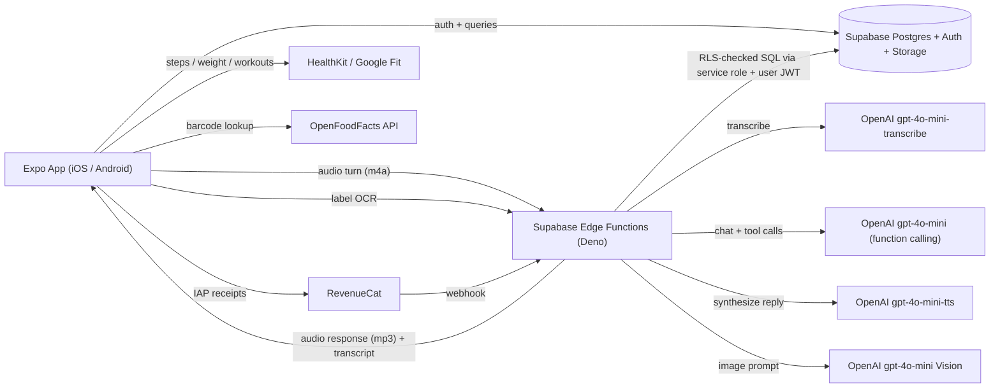

# AI Kitchen — MVP Plan

> Source of truth for the design + scope decisions. Last reviewed: see `STATUS.md` for current progress.

## Overview

Lean MVP for a cross-platform calorie- and nutrition-tracking app built with Expo (React Native + TypeScript), Supabase, and OpenAI's STT/LLM/TTS APIs. Positioned for nutrition newcomers — not gym-literate macro counters — it pairs clean, plain-language tracking (calories, macros, fiber, sugar, sodium, activity) with friendly AI nudges and a turn-by-turn voice cooking assistant that dynamically rebalances recipes to fit the user's day. Tiered subscription monetization.

## Vision

A **calorie and nutrition tracker for normal people**. Calories, protein, carbs, fat, fiber, sugar, sodium, and activity are all tracked and visible — just laid out cleanly, in plain language, without the dense graphs and clinical tone of MyFitnessPal. A friendly AI layer adds two things on top:

1. **Gentle, contextual nudges** ("You're low on fiber today — a side of beans with dinner would help") that quietly educate the user as they track.
2. **A voice-guided cooking assistant** that watches the day's totals and rebalances recipe portions in real-time so the meal fits.

**Tagline direction:** *"Eat better. We'll keep it simple."*

## Who this is for (and who it isn't)

- **Primary audience**: people who want to eat better, lose or maintain weight, or just feel more in control of food, but find existing apps (MyFitnessPal, MacroFactor, Cronometer) cold, jargon-heavy, and built for gym people. They want to track — they just want a friendlier, less intimidating version of it.
- **Closest analogues**: Noom (behavioral coaching, ~$3B+ business) and Cal AI (AI-powered convenience, ~$30M ARR in <1 year). Both prove this segment pays. Your wedge over both: **AI that actually cooks with you**, the single most teachable moment in someone's nutrition day.
- **Not the target (yet)**: bodybuilders, competitive athletes, people already comfortable with macro tracking. They have their tools and they're a small market anyway.

**Product implication that runs through everything:** numbers stay visible, but the UI is opinionated about *which* numbers matter and presents them with one-line friendly context. Every label, push notification, and AI utterance is written for someone who's never thought about protein in their life — without being condescending.

## Differentiators (in order of importance)

1. **Voice cooking that adjusts to your day** — no competitor does this.
2. **AI nudges, not graphs** — instead of charts the user has to interpret, the app surfaces 1–3 plain-language insights per day about fiber, micronutrients, activity, or balance.
3. **Friendlier tracking UX** — calories and macros visible, but laid out as a clean daily view rather than dense dashboards. Friendly food names, big tap targets, no jargon.
4. **AI-assisted logging** — barcode + nutrition label OCR mean the user almost never types nutrition info by hand.

## Recommended stack

- **Mobile**: Expo (React Native) + TypeScript, Expo Router, NativeWind, Zustand, TanStack Query, react-native-reanimated.
- **Audio + camera**:
  - `expo-av` — audio recording + playback for the voice cooking turn flow (no native module surgery needed; works in Expo Go for dev).
  - `react-native-vision-camera` — nutrition label OCR + barcode scanning (requires Expo dev client).
- **Backend**: Supabase (Postgres + Auth + Storage + Edge Functions in Deno).
- **AI**:
  - OpenAI `gpt-4o-mini-transcribe` — STT for each voice turn.
  - OpenAI `gpt-4o-mini` (text, with function calling) — cooking coach reasoning + tool execution.
  - OpenAI `gpt-4o-mini-tts` — TTS for the AI's spoken response.
  - OpenAI `gpt-4o-mini` (Vision) — nutrition label parsing.
- **Nutrition data**: USDA FoodData Central (free) + OpenFoodFacts (free, barcode-keyed) seeded into Supabase. User-created foods on top.
- **Subscriptions**: RevenueCat SDK + Supabase webhook to flip `subscription_tier`.
- **Health data**: `react-native-health` (HealthKit) + `react-native-google-fit`.
- **Observability**: Sentry (errors), PostHog (product analytics), Supabase logs.
- **CI/CD**: EAS Build, EAS Submit, EAS Update for OTA prompt/UI iteration.

## Architecture

**Voice turn flow**: the app records a short utterance with `expo-av`, uploads it to the `voice-turn` Edge Function, which orchestrates STT → LLM (with tools) → TTS in a single request and streams audio back. All tool execution (read calorie budget, adjust ingredient, log meal) happens server-side in the Edge Function using the user's authenticated Supabase context, so no round-trips to the client mid-turn. After the AI's audio finishes playing on the device, the mic auto-reopens for 5 seconds to catch a natural follow-up before closing.

## Data model (Postgres, all tables RLS-protected by `user_id`)

- `profiles` — user_id, name, sex, dob, height_cm, weight_kg, activity_level, weight_goal_kg, kcal_goal, protein_g_goal, carb_g_goal, fat_g_goal, **fiber_g_goal**, **sodium_mg_cap**, **sugar_g_cap**, subscription_tier, voice_minutes_used_this_month, **nutrition_literacy** (`beginner` default | `intermediate` | `advanced`) — drives tone of AI responses and how much explanation to give.
- `foods` — id, name, brand, serving_size_g, kcal_per_100g, protein_g, carb_g, fat_g, **fiber_g, sugar_g, sodium_mg, vit_c_mg, iron_mg, calcium_mg, potassium_mg** (nullable — populated when source provides them), source (`usda` | `off` | `user` | `ai`), barcode, owner_id (nullable for seeded).
- `nudges` — id, user_id, kind (`low_fiber` | `high_sodium` | `low_protein` | `low_micronutrient` | `inactive_day` | `balanced_day` | `streak` | ...), title, body, scheduled_for, dismissed_at, acted_on (bool). Nudge generation is a daily Edge Function cron that runs cheap deterministic rules first, then `gpt-4o-mini` only for personalized wording.
- `food_logs` — id, user_id, food_id, grams, meal_type, logged_at.
- `recipes` — id, owner_id (nullable for seeded), title, description, servings, total_time_min, hero_image_url, instructions_jsonb.
- `recipe_ingredients` — id, recipe_id, food_id, grams, optional, substitute_food_ids[].
- `cooking_sessions` — id, user_id, recipe_id, started_at, ended_at, voice_seconds_used, final_kcal, status.
- `ai_messages` — id, session_id, role, content, tool_calls_jsonb, created_at.
- `weight_logs` — id, user_id, weight_kg, recorded_at, source (`manual` | `healthkit` | `googlefit`).
- `activity_logs` — id, user_id, type, duration_min, kcal_burned, recorded_at, source.

Daily totals are computed views (`v_daily_intake`) so today's progress is one indexed query.

## Lean MVP feature scope (the 4–6 week build)

1. **Onboarding & profile (plain-language)**
   - Email + Apple/Google sign-in (Apple Sign-In is required by App Store policy).
   - Wizard uses friendly phrasing, not jargon:
     - "How much do you move on a typical day?" (Mostly sitting / Some walking / On my feet a lot / I work out most days) → maps to activity multiplier.
     - "What do you want to focus on?" (Lose weight gently / Lose weight steadily / Stay where I am / Build a bit / Just eat better) → maps to deficit/surplus and macro split.
     - "How comfortable are you with nutrition?" (Beginner / I know the basics / I track macros already) → sets `nutrition_literacy`.
   - Every input has a "What does this mean?" tap target.
   - Mifflin-St Jeor BMR + activity multiplier compute the kcal goal; user sees it explicitly with one line of context ("We'll aim for around 1,800 a day — that gives you a gentle deficit toward your goal.").
   - Default fiber goal: 25g (women) / 38g (men). Sodium cap: 2,300mg. Added-sugar cap: 50g. All editable.
   - **No weight goal pressure**: "Just eat better" is a first-class option with no calorie deficit applied.
2. **Food logging (AI does the typing)**
   - Search foods (Postgres `pg_trgm` fuzzy) seeded with USDA top-N + OpenFoodFacts on-demand. Friendly names ("Greek yogurt, plain") preferred over USDA SR codes.
   - Barcode scan (vision-camera) → OpenFoodFacts lookup → one-tap add.
   - Nutrition label scan: photo → Edge Function → `gpt-4o-mini` Vision → structured food → user confirms → saved as `source = 'user'`.
   - Quick-log: most recent + most frequent foods, big tap targets, on the home screen.
   - Each food entry shows kcal, protein/carb/fat, and fiber/sugar/sodium when available. Micronutrients are stored but not shown per-entry — they roll up into the daily nudge engine.
3. **Today screen — clean tracker**
   - Top: a single kcal number with remaining for the day ("1,210 / 1,800 — 590 to go"). Subtle ring around it.
   - Below: a horizontal bar row for protein / carbs / fat, each with current/goal and a soft progress fill. Compact, not three separate big rings.
   - **Today's notes** section (1–3 plain-language AI nudges, see #5):
     - "Light on fiber so far — beans or whole grains tonight would help."
     - "You hit your protein target — nice."
     - "Sodium is creeping up — go easy on the soy sauce."
   - Meals listed by meal type with friendly food names.
   - Streak counter, low-key ("5 days in a row").
   - Tappable expansion to see fiber / sugar / sodium totals and a weekly mini-trend.
4. **AI nudges engine (the "approachable" surface)**
   - **Daily cron Edge Function** runs at the user's local end-of-day and at noon. Reads `v_daily_intake` + recent days + activity + profile.
   - **Deterministic rules first** (cheap): fiber < 60% of goal → low-fiber nudge; sodium > 90% of cap → high-sodium nudge; protein < 70% → low-protein; no activity from HealthKit + sitting activity_level → inactive-day nudge; 3+ days low on the same micronutrient → micronutrient nudge.
   - **`gpt-4o-mini` only for wording** (~$0.0002 per nudge) — given the rule's structured trigger + user's nutrition_literacy + 2-line tone guide, produces one warm sentence.
   - Surfaced in **Today's notes** + optionally a push notification (rate-limited: max 1/day, none on weekends unless action-relevant).
   - Never preachy. No "shame" triggers. Always actionable ("...a side of berries tonight would do it") not just diagnostic ("you're low on fiber").
5. **Recipes (seeded, 8–10 hand-picked beginner-friendly)**
   - Browse, view ingredients with per-serving kcal + macros + fiber.
   - "Cook with me" CTA (not "Start cooking" — softer).
6. **The voice cooking assistant (the headline feature) — turn-by-turn, coach-toned**
   - On "Cook with me" the app opens the cooking session screen showing the recipe checklist + a big mic button. A `cooking_sessions` row is created.
   - **Trigger options** (all free, no API cost): tap mic button, hardware volume-button shortcut (great for dirty hands), or **auto-listen** for 5 seconds after every AI response.
   - **Per-turn flow**:
     1. `expo-av` records user utterance into a short m4a (auto-stop on 1.5s silence via on-device VAD threshold).
     2. POST to `voice-turn` Edge Function with audio + session_id.
     3. Edge Function: STT (`gpt-4o-mini-transcribe`) → LLM (`gpt-4o-mini` with function-calling, conversation history loaded from `ai_messages`) → tool execution server-side → TTS (`gpt-4o-mini-tts`) → response.
     4. App plays returned audio while displaying the transcript and any UI updates (ingredient checked, portion adjusted).
   - **Tools** (all executed server-side inside the Edge Function via the user's auth context):
     - `get_remaining_nutrients_today()` — returns kcal + protein + fiber + sodium remaining.
     - `get_recipe_state()` — current per-ingredient state for this session.
     - `adjust_ingredient(name, new_grams, reason)` — writes to `cooking_sessions.adjustments`, returns updated macros.
     - `suggest_substitute(name)` — RAG-style lookup over the foods table for similar foods within macro tolerance.
     - `request_label_scan()` — returns a flag the client uses to open the camera; subsequent turn carries the parsed nutrition.
     - `log_meal_from_recipe()` — finalizes the session and creates the `food_log` entry.
     - `end_session()`.
   - **System prompt is the product**. Encodes: be brief and warm; assume user is new to nutrition; explain the *why* in one short sentence when making suggestions; minimize jargon; confirm before any change; celebrate small wins; never shame; proactively call out fiber/sodium/protein implications of adjustments, not just calories; use the user's `nutrition_literacy` to calibrate explanation depth. Versioned + OTA-updatable via EAS Update.
   - Live transcript + ingredient checklist visible on screen for accessibility, muted environments, and noisy kitchens.
   - On session end: confirmed final ingredient list logged as a single `food_log` entry referencing the recipe.
   - **Cost per turn**: ~$0.002–0.005. A 20-turn session ≈ **$0.05–0.10**.
7. **HealthKit / Google Fit (read-only, MVP scope)**
   - Pull weight, steps, and burned calories (workouts + steps).
   - Burned calories extend the day's kcal budget transparently (visible on Today screen: "+220 from your walk").
   - Activity-based nudges ("You've been sitting most of the day — a quick walk would offset that snack") use steps + last-workout timestamp.
8. **Subscriptions (RevenueCat)**
   - **Free**: food log + recipe browse + 5 voice cooking sessions / month + 5 label scans / month + AI nudges.
   - **Premium $9.99/mo or $59.99/year**: unlimited logging + label scans + unlimited voice cooking sessions + AI ingredient adjustments outside voice sessions + richer weekly summary.
   - **Pro $14.99/mo or $89.99/year**: everything in Premium + future **Live Mode** (persistent Realtime API voice — post-MVP), meal planning (post-MVP), trend insights.
   - Per-turn quotas enforced by the `voice-turn` Edge Function (read profile.subscription_tier + monthly counter at the start of each turn).
   - Paywall copy: "Cook with your AI coach. Track without the spreadsheet."
9. **Cross-cutting**
   - Sentry, PostHog, paywall A/B via RevenueCat, push notifications (Expo) — friendly, non-naggy ("Want a hand picking lunch?" rather than "Log your meal!").

## Post-MVP backlog (call out in app store roadmap; build after validating retention)

- **"Live Mode" (Pro tier)** — persistent OpenAI Realtime API voice session for the most natural hands-free cooking flow; opt-in toggle, separate quota.
- **On-device wake word** ("Hey Chef") via Picovoice Porcupine — fully hands-free without needing the volume-button shortcut.
- **"Ask anything" nutrition chat** — text/voice Q&A backed by `gpt-4o-mini` with access to user's recent log.
- **Barcode-batch pantry** ("scan everything in your fridge once, AI plans the week").
- **Recipe import from URL or cookbook photo** (`gpt-4o-mini` Vision → structured recipe).
- **Voice quick-log** outside cooking ("I just ate two eggs and toast") — reuses Realtime infra with a different system prompt.
- **Meal planning**: 7-day plan generated to hit weekly macro targets given a pantry list and time budget.
- **Weekly AI nutrition report**: trends, adherence, suggestions.
- **Social / sharing**: share a cooked recipe + macro card.
- **Apple Watch companion**: timers + "what's next" prompts during cooking.
- **Manual activity logger** with custom activities + MET-based kcal estimation (HealthKit covers MVP).
- **Family / household sharing**: scaled recipes for N people, per-person macro tracking.
- **Offline-first food log** with conflict-resolved sync.

## Unit economics & pricing rationale

- Voice cooking session (turn-by-turn STT + LLM + TTS, 20 turns avg): **~$0.05–0.10/session**.
- AI nudges (1–2/day, `gpt-4o-mini` for wording only): ~$0.01/user/month. Negligible.
- Nutrition label OCR (`gpt-4o-mini` Vision): ~$0.002/scan. Negligible at 5/month free cap.
- Premium tier (unlimited voice cooking) AI cost ceiling: ~$1/user/month worst case, realistically ~$0.30–0.50.
- After 30% Apple cut on $9.99: $6.99 revenue − ~$0.50 AI − ~$0.10 Supabase ≈ **~$6.40 net** per active Premium user.
- After year-1 Apple cut shift (30%→15%): ~$7.90 net.
- Hard limits enforced server-side at the start of every voice turn; soft warnings in-app at 80% usage.
- All cheap models. No Realtime API at MVP.

## Implementation order (4–6 weeks, solo, full-time)

- **Week 1**: Expo + EAS scaffold, Supabase project, schema + RLS (incl. nudges + fiber/sugar/sodium/micros), auth flow, onboarding wizard, kcal/macro goal calc, today screen skeleton.
- **Week 2**: Food search + USDA/OFF seeding script (with fiber/sugar/sodium/micros), manual food log, barcode scan, quick-log, today screen with kcal + macro bars + meals list.
- **Week 3**: Recipes (seeded data), recipe detail screen, HealthKit/Google Fit read, label OCR via Vision Edge Function, AI nudges engine (deterministic rules + `gpt-4o-mini` wording) + Today's notes UI.
- **Week 4**: Voice cooking assistant end-to-end (`voice-turn` Edge Function orchestrating STT + LLM + tools + TTS, expo-av record/play client, hardware volume-button shortcut, auto-listen-5s, transcript UI, session persistence).
- **Week 5**: RevenueCat integration, paywall, quota enforcement, Sentry/PostHog, polish, App Store assets.
- **Week 6**: TestFlight + Play Internal Testing, fix-its, submit.

## Key risks & mitigations

- **AI cost overrun** → hard server-side quotas at the start of every voice turn, all-mini models, max turn audio length cap (30s in, 20s out), session inactivity timeout.
- **Voice turn latency** (STT + LLM + TTS sequential could feel slow) → stream the TTS audio as it generates so playback starts in <1.5s; cache common short responses ("got it", "sounds good"); keep LLM context windows small (last 6 turns only).
- **App Store review friction on health claims** → avoid medical language ("for informational purposes, not medical advice"), no diagnosis claims.
- **Retention** → streak + weekly summary push + the voice cooking experience itself as the differentiated hook.
- **Audio recording UX in noisy kitchens** → adjustable on-device VAD threshold, "stop" button always visible, manual re-record option, transcript shown so user can verify before AI acts.

## Key decisions made along the way

- **Turn-by-turn voice (STT + LLM + TTS) instead of OpenAI Realtime persistent session.** 5–10× cheaper (~$0.05/session vs $0.30–0.60), simpler to implement (no WebRTC native module), and the UX gap is small once auto-listen-after-response is in place. "Live Mode" (persistent Realtime) is reserved as a post-MVP Pro-tier upgrade.
- **Supabase over Firebase.** Postgres fits a nutrition app (daily aggregations, ingredient joins) while Firestore would charge per-document-read for every Today-screen render. Predictable $25/mo flat pricing.
- **Friendlier positioning, not fitness-oriented.** Primary audience is people who want to eat better but don't know macros from menus. Competitors here are Noom and Cal AI, not MyFitnessPal.
- **AI nudges in-app, not "Ask anything" chat.** Nudges are surfaced contextually (Today screen) and educate quietly. A chat tab would scope-creep the MVP and most questions are better answered as nudges around what the user is already doing.
- **Numbers visible by default.** Earlier draft hid numbers behind a "Simple mode" toggle; reversed because the app is still a tracker — the differentiation is friendlier presentation, not less data.

## Key files (forward reference)

- `app/(tabs)/index.tsx` — Today screen.
- `app/cook/[recipeId].tsx` — voice cooking session screen.
- `lib/voice/recorder.ts` — expo-av recording + on-device VAD trim + upload.
- `lib/voice/player.ts` — streamed TTS playback + auto-listen-5s loop.
- `lib/voice/tools.ts` — tool schemas shared between client and Edge Function.
- `lib/nutrition/calc.ts` — BMR/TDEE, macro math, ingredient rebalancing.
- `supabase/functions/voice-turn/index.ts` — STT → LLM (with tool execution) → TTS orchestrator + quota check.
- `supabase/functions/vision-label/index.ts` — nutrition label OCR.
- `supabase/functions/nudges-daily/index.ts` — cron-triggered nudge generator (rules + LLM wording).
- `supabase/functions/revenuecat-webhook/index.ts` — subscription tier sync.
- `supabase/migrations/0001_init.sql` — schema + RLS policies (incl. nudges + micronutrients).
- `scripts/seed_foods.ts` — USDA + OFF seeding (with fiber/sugar/sodium/micros).
